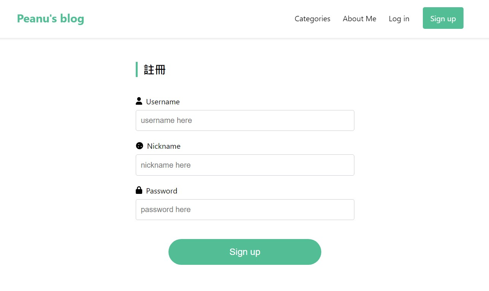

# React Blog

連結：https://jubeatt.github.io/React-blog/

## 這是什麼？

這是用 React 串接 [Lidemy 學生專用 API Server](https://github.com/Lidemy/lidemy-student-json-api-server) 打造的簡易部落格。

目前做好的功能有：

- 登入 / 註冊機制
- 發文功能
- 顯示文章列表
- 分頁功能
- Markdown 編輯器
- RWD

大概就這樣吧！不過我希望這個部落格可以更完整一些，希望之後可以有：

- 文章留言功能
- 個人 Profile 頁面
- 每個使用者都可以有自己的文章列表

所以，沒意外的話之後會自己重新寫一個後端來串吧，目前這個 API 能做的事情非常有限，加油加油～

## 網頁預覽

### 首頁

### 單篇文章

### 註冊頁面

### 登入頁面

### 編輯頁面

## 主要參考的設計稿

### 網站整體

從 Dribbble 找到 [Weronika Prasek](https://dribbble.com/shots/15315334--Segment-Blog) 設計的網頁（也參考了一些 Medium 的元素）

### 登入和註冊表單

從 Dribbble 找到 [Pixsellz](https://dribbble.com/shots/16502934-Sign-up-Log-in) 設計的表單
